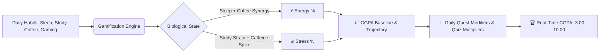

<div align="center">

```
  ██████╗  ██████╗██████╗  █████╗ 
 ██╔════╝ ██╔════╝██╔══██╗██╔══██╗
 ██║  ███╗██║     ██████╔╝███████║
 ██║   ██║██║     ██╔═══╝ ██╔══██║
 ╚██████╔╝╚██████╗██║     ██║  ██║
  ╚═════╝  ╚═════╝╚═╝     ╚═╝  ╚═╝
```

# ⚡ ACADEMIC SURVIVAL SIMULATOR
### *The Cyberpunk Scholar RPG & AI-Driven Academic Trajectory Optimizer*

<p align="center">
  <b>Transforming daily student habits, academic burnout, and exam anxiety into a gamified survival run powered by real-time machine learning & Google Gemini AI.</b>
</p>

[](https://nextjs.org/)
[](https://react.dev/)
[](https://www.typescriptlang.org/)
[](https://fastapi.tiangolo.com/)
[](https://ai.google.dev/)
[](https://tailwindcss.com/)
[](https://supabase.com/)
[](https://razorpay.com/)

<br/>

[🌟 Explore Features](#-core-gameplay--features) • [🧠 The Engine Math](#-the-simulation--mathematics-engine) • [📐 System Architecture](#-system-architecture) • [🚀 Quick Start](#-quick-start-guide) • [📡 API Reference](#-api-endpoints-reference)

<br/>

---

</div>

## 🌌 The Premise

College and university academics operate like an intense survival run:
- **Sleep deprivation** destroys your cognitive retention.
- **Excessive caffeine** spikes short-term alertness but triggers exponential stress crashes.
- **Grind without strategy** leads to diminishing returns and academic burnout.

**Academic Survival Simulator** gamifies your academic life into an interactive Cyberpunk Command Terminal. It models your biological parameters (*Energy, Stress, Rest, Focus*) against your academic load, dynamically simulating your **CGPA Trajectory (3.00 ➔ 10.00)** while providing an **AI Socratic Companion** and **Automated Essay Grader** to level up your actual skills in real life.

---

## 🎮 Core Gameplay & Features

<table>
  <tr>
    <td width="50%">
      <h3 align="center">🕹️ 1. Dynamic Habit Engine</h3>
      <p>Log your daily <b>Sleep</b>, <b>Study Hours</b>, <b>Coffee Intake</b>, and <b>Gaming/Leisure</b>. The simulation engine dynamically outputs real-time Energy (%) and Stress (%) gauges, warning you of impending burnout or peak flow states.</p>
      <ul>
        <li><b>Warrior Mode</b>: 6h Sleep / 8h Study / 3 Coffee / 1h Gaming</li>
        <li><b>Balanced Scholar</b>: 7.5h Sleep / 5h Study / 2 Coffee / 2h Gaming</li>
        <li><b>Night Owl</b>: 5h Sleep / 7h Study / 4 Coffee / 3h Gaming</li>
        <li><b>Chill Student</b>: 9h Sleep / 4h Study / 1 Coffee / 4h Gaming</li>
      </ul>
    </td>
    <td width="50%">
      <h3 align="center">🤖 2. Socratic AI Mascot ("Scholar Sprite")</h3>
      <p>Your in-simulation companion powered by <b>Google Gemini 2.5 Flash</b>. It doesn't just give answers — it coaches you through complex concepts with Socratic questioning, real-time hints, and dynamic audio soundscapes.</p>
      <ul>
        <li>Instant step-by-step topic decomposition</li>
        <li>Context-aware motivation and burnout advice</li>
        <li>Voice synthesizer & interactive UI reactions</li>
      </ul>
    </td>
  </tr>
  <tr>
    <td width="50%">
      <h3 align="center">📝 3. Multi-Tier Essay Arena</h3>
      <p>Submit writing assignments tailored from <b>High School</b> to <b>PhD Doctorate</b> tiers across 6 major academic fields:</p>
      <ul>
        <li>💻 Computer Science & AI</li>
        <li>⚙️ Engineering & Physics</li>
        <li>🧬 Medicine & Life Sciences</li>
        <li>⚖️ Law & Governance</li>
        <li>📈 Business & Economics</li>
        <li>🎨 Humanities & Philosophy</li>
      </ul>
      <p>Get evaluated on <i>Thesis Precision</i>, <i>Argument Cohesion</i>, <i>Evidence Integration</i>, and <i>Academic Voice</i>.</p>
    </td>
    <td width="50%">
      <h3 align="center">⚡ 4. Quests, Quizzes & Leaderboards</h3>
      <p>Earn XP, unlock badges, and level up your CGPA through daily missions:</p>
      <ul>
        <li><b>Daily Timed Quizzes</b>: Level-tailored academic challenges with instant scoring.</li>
        <li><b>Quest Log</b>: Daily and weekly milestone bounties.</li>
        <li><b>Revision Shelf</b>: AI-generated flashcards with active recall testing.</li>
        <li><b>Global Leaderboard</b>: Real-time student ranking across global cohorts.</li>
      </ul>
    </td>
  </tr>
</table>

---

## 🧠 The Simulation & Mathematics Engine

The simulator calculates real-time bio-cognitive states and academic growth using a multi-variable balancing model:



### 🧮 Mathematical Modeling Formulas

1. **Energy Formula**:
   $$\text{Energy} = \text{clamp}\Big(0, 100, (\text{Sleep} \times 12.5) - (\text{Study} \times 3.0) + (\text{Gaming} \times 2.0) - (\text{Coffee} > 3 \ ?\ (\text{Coffee} - 3) \times 7.5 : 0)\Big)$$

2. **Stress Formula**:
   $$\text{Stress} = \text{clamp}\Big(0, 100, (\text{Study} \times 8.5) + (\text{Coffee} \times 6.0) - (\text{Sleep} \times 7.0) - (\text{Gaming} \times 4.0)\Big)$$

3. **Starting Baseline CGPA Allocation**:
   $$\text{CGPA}_{\text{start}} = 3.00 + \text{clamp}\Big(0.00, 0.50, (\text{Energy} \times 0.003) + (\text{Study} \ge 6 \ ?\ 0.15 : 0.05) - (\text{Stress} > 60 \ ?\ 0.10 : 0)\Big)$$

---

## 📐 System Architecture

The application adopts a high-performance decoupled architecture designed for speed, zero API leakage, and robust security:

```mermaid
flowchart TD
    Client["💻 Client Browser (Next.js 16 + React 19 UI)"]
    
    subgraph Frontend_App["⚡ Frontend App (Next.js SSR & Route Handlers)"]
        Pages["App Router Pages (/dashboard, /essay-mode, /onboarding, etc.)"]
        MascotAPI["/api/mascot/explain (Gemini SDK)"]
        QuizAPI["/api/quiz/submit"]
        EssayAPI["/api/essay/submit"]
        PaymentAPI["/api/payments/razorpay"]
    end
    
    subgraph Data_Layer["🗄️ Supabase Cloud & PostgreSQL"]
        Auth["Supabase Auth (JWT SSR Cookies)"]
        DB["PostgreSQL (Habit Logs, Quizzes, Essays, Profiles)"]
        RLS["Row Level Security Policies (RLS)"]
    end
    
    subgraph Internal_ML["🐍 Python FastAPI Analytics Service (127.0.0.1)"]
        Trajectory["/analytics/trajectory (ML Regression Engine)"]
        RiskModel["/analytics/burnout-risk (Predictive Modeling)"]
    end

    Client <-->|HTTPS / React 19 Hydration| Pages
    Pages --> MascotAPI & QuizAPI & EssayAPI & PaymentAPI
    Pages <-->|Session Tokens| Auth
    MascotAPI & QuizAPI & EssayAPI <-->|SQL Queries / Mutations| DB
    DB --- RLS
    Pages <-->|Internal HTTP (Private Subnet)| Internal_ML
```

---

## 🛠️ Technology Stack

| Layer | Technologies |
| :--- | :--- |
| **Frontend Framework** | [Next.js 16.3 (App Router)](https://nextjs.org/), [React 19.2](https://react.dev/), [TypeScript 5](https://www.typescriptlang.org/) |
| **Styling & UI** | [Tailwind CSS v4](https://tailwindcss.com/), [Framer Motion 13](https://www.framer.com/motion/), [Lucide Icons](https://lucide.dev/), [tw-animate-css](https://www.npmjs.com/package/tw-animate-css) |
| **AI & Intelligence** | [Google Gemini 2.5 SDK (`@google/genai`)](https://ai.google.dev/), Prompt Engineering Pipeline |
| **Database & Auth** | [Supabase Database (PostgreSQL)](https://supabase.com/), [Supabase SSR Auth](https://supabase.com/docs/guides/auth/server-side/creating-a-client) with RLS |
| **Internal Analytics Service** | [Python 3.11+](https://www.python.org/), [FastAPI](https://fastapi.tiangolo.com/), [Uvicorn](https://www.uvicorn.org/), [Pydantic v2](https://docs.pydantic.dev/) |
| **Monetization & Payments** | [Razorpay SDK](https://razorpay.com/docs/) with Webhook Verification |
| **Testing & Tooling** | [Vitest](https://vitest.dev/), [@vitest/coverage-v8](https://vitest.dev/guide/coverage.html), ESLint 9 |

---

## 🚀 Quick Start Guide

### Prerequisites
- **Node.js**: `v20.x` or later
- **Python**: `v3.11` or later
- **Supabase**: Free project for Postgres & Auth
- **Google Gemini API Key**: Free tier available from [Google AI Studio](https://aistudio.google.com/)

---

### 📦 1. Clone & Set Up Directory

```bash
git clone https://github.com/shinwontforget/Student-analysis.git
cd student-analysis/academic-survival-simulator
```

---

### ⚡ 2. Frontend Configuration & Launch

```bash
cd frontend
npm install
```

Create a `.env.local` file inside `frontend/`:

```ini
# --- SUPABASE CONFIGURATION ---
NEXT_PUBLIC_SUPABASE_URL=https://your-project-ref.supabase.co
NEXT_PUBLIC_SUPABASE_ANON_KEY=your-anon-public-key
SUPABASE_SERVICE_ROLE_KEY=your-service-role-key

# --- AI CONFIGURATION ---
GEMINI_API_KEY=AIzaSyYourGeminiApiKeyHere

# --- INTERNAL PYTHON ANALYTICS BACKEND ---
INTERNAL_ANALYTICS_URL=http://127.0.0.1:8000

# --- RAZORPAY (OPTIONAL FOR PRO UPGRADE) ---
RAZORPAY_KEY_ID=rzp_test_your_key_id
RAZORPAY_KEY_SECRET=your_key_secret
```

Launch the Next.js development server:

```bash
npm run dev
```

> 🌐 Frontend runs at: **`http://localhost:3000`**

---

### 🐍 3. Python Analytics Engine Setup

In a separate terminal:

```bash
cd academic-survival-simulator/backend

# Create virtual environment
python -m venv .venv

# Activate environment
# On Windows:
.venv\Scripts\activate
# On Linux/macOS:
source .venv/bin/activate

# Install dependencies
pip install -r requirements.txt
```

Create `.env` in `backend/`:

```ini
ENV=development
HOST=127.0.0.1
PORT=8000
```

Start the FastAPI microservice:

```bash
python main.py
```

> ⚙️ FastAPI runs at: **`http://127.0.0.1:8000`** (Health check: `/health`)

---

### 🗄️ 4. Supabase Database Schema

Open your [Supabase SQL Editor](https://supabase.com/dashboard) and run the setup script found at [`frontend/supabase/schema.sql`](academic-survival-simulator/frontend/supabase/schema.sql):

- Creates `users`, `daily_habit_logs`, `essays`, `essay_reviews`, and `quizzes`
- Auto-configures user profile synchronization triggers on `auth.users`
- Enforces strict Row Level Security (RLS) policies

---

## 📡 API Endpoints Reference

### Next.js Server-Side API Handlers

| Route | Method | Description | Auth Required |
| :--- | :--- | :--- | :---: |
| `/api/mascot/explain` | `POST` | Dispatches query to Google Gemini 2.5 with Socratic context prompts | ✅ |
| `/api/essay/submit` | `POST` | Evaluates academic essays across 4 rubric dimensions | ✅ |
| `/api/quiz/submit` | `POST` | Validates answers, calculates XP delta, updates user CGPA | ✅ |
| `/api/payments/create-order` | `POST` | Initiates Razorpay Pro subscription checkout order | ✅ |
| `/api/payments/verify` | `POST` | Verifies cryptographic signature and upgrades user to Pro | ✅ |

### Internal FastAPI Analytics Endpoints

| Route | Method | Description | Security |
| :--- | :--- | :--- | :--- |
| `GET /health` | `GET` | Microservice heartbeat and uptime check | Open to Localhost |
| `POST /analytics/trajectory` | `POST` | Calculates ML polynomial curve fit for 30-day CGPA forecast | Localhost Only |
| `POST /analytics/burnout-risk` | `POST` | Computes cumulative stress decay and burnout index | Localhost Only |

---

## 🧪 Testing & Code Standards

```bash
# In frontend/
npm run test           # Run Vitest test suite
npm run test:coverage  # Generate coverage reports
npm run typecheck      # TypeScript static analysis
npm run lint           # ESLint checking
```

---

## 🔒 Security & Best Practices

- **Zero Client-Side Secret Exposure**: All AI interactions and private database queries execute server-side within Next.js Route Handlers.
- **Localhost Boundary Defense**: The Python FastAPI service strictly binds to `127.0.0.1`, guaranteeing it remains inaccessible from public network interfaces.
- **Row Level Security (RLS)**: PostgreSQL tables are locked down to individual authenticated user IDs with cryptographic validation.

---

## 🗺️ Roadmap

- [x] Next.js 16 App Router migration & Cyberpunk UI Design
- [x] Google Gemini 2.5 AI Mascot with Voice Synthesis
- [x] Multi-tier Essay Grading Engine with Custom Academic Disciplines
- [x] Dynamic Energy & Stress Bio-Simulator
- [x] Razorpay Pro Subscription Integration
- [ ] Mobile PWA & Offline Habit Logger
- [ ] Multiplayer Study Guilds & Real-Time Exam Boss Battles

---

<div align="center">

### 🎓 Level up your academics. Outsmart burnout. Master the simulation.

Crafted with 💜 for students worldwide.

</div>
