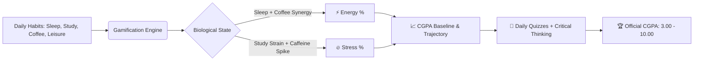

<div align="center">

```
  ██████╗  ██████╗██████╗  █████╗ 
 ██╔════╝ ██╔════╝██╔══██╗██╔══██╗
 ██║  ███╗██║     ██████╔╝███████║
 ██║   ██║██║     ██╔═══╝ ██╔══██║
 ╚██████╔╝╚██████╗██║     ██║  ██║
  ╚═════╝  ╚═════╝╚═╝     ╚═╝  ╚═╝
```

# 🏛️ ACADEMIC SURVIVAL SIMULATOR
### *The Oxford-Inspired AI Academic Performance Optimizer & Merit Arena*

<p align="center">
  <b>Transforming daily student habits, academic burnout, and exam preparation into a structured, merit-driven simulation powered by real-time machine learning & Google Gemini AI.</b>
</p>

[](https://nextjs.org/)
[](https://react.dev/)
[](https://www.typescriptlang.org/)
[](https://fastapi.tiangolo.com/)
[](https://ai.google.dev/)
[](https://tailwindcss.com/)
[](https://supabase.com/)
[](#-merit-locked-exam-arena)

<br/>

[🌟 Features](#-core-features) • [🧠 Simulation Math](#-the-simulation--mathematics-engine) • [📐 System Architecture](#-system-architecture) • [🚀 Quick Start](#-quick-start-guide) • [📡 API Reference](#-api-endpoints-reference) • [🔒 Security](#-security--defense-in-depth)

<br/>

---

</div>

## 🌌 The Premise

University and high school academics require strategy and biological balance:
- **Sleep deprivation** impairs working memory and long-term conceptual retention.
- **Excessive caffeine** spikes alertness temporarily but triggers compounding stress crashes.
- **Unstructured cramming** yields diminishing returns and severe academic burnout.

**Academic Survival Simulator** equips students with an **Oxford Executive Slate & Royal Indigo** academic workstation. It models biological parameters (*Energy, Stress, Rest, Focus*) against coursework load, simulating your **CGPA Trajectory (3.00 ➔ 10.00)** while providing an **AI Socratic Mascot ("Byte")**, **Anti-Spoofing MCQ Assessments**, and a **Merit-Locked 1-Hour Subjective Exam Arena** for top scholars.

---

## 🎮 Core Features

<table>
  <tr>
    <td width="50%">
      <h3 align="center">📊 1. Bio-Cognitive Habit Engine</h3>
      <p>Log daily <b>Sleep</b>, <b>Study Hours</b>, <b>Coffee Intake</b>, and <b>Leisure</b>. The mathematical engine outputs real-time Energy (%) and Stress (%) gauges, warning of burnout risks and predicting performance trends.</p>
      <ul>
        <li><b>Warrior Routine</b>: 6h Sleep / 8h Study / 3 Coffee / 1h Leisure</li>
        <li><b>Balanced Scholar</b>: 7.5h Sleep / 5h Study / 2 Coffee / 2h Leisure</li>
        <li><b>Night Owl</b>: 5h Sleep / 7h Study / 4 Coffee / 3h Leisure</li>
        <li><b>Restorative</b>: 9h Sleep / 4h Study / 1 Coffee / 4h Leisure</li>
      </ul>
    </td>
    <td width="50%">
      <h3 align="center">🦉 2. Socratic AI Mascot ("Byte")</h3>
      <p>An encouraging, analytical companion powered by <b>Google Gemini 2.5 Flash</b>. It synthesizes raw lecture notes into ultra-concise definitions, real-world analogies, and tactical exam gotchas.</p>
      <ul>
        <li>Instant concept summaries & ELI5 explanations</li>
        <li>Aggressive note compressor & flashcard builder</li>
        <li>Rolling rate limiter (15 requests/day) with graceful fallback</li>
      </ul>
    </td>
  </tr>
  <tr>
    <td width="50%">
      <h3 align="center">🏛️ 3. Merit-Locked Exam Arena</h3>
      <p>Unlocked strictly when students achieve <b>CGPA ≥ 7.50</b>. An intense 60-minute, 5-question comprehensive written examination across 6 academic fields:</p>
      <ul>
        <li>💻 Computer Science & AI</li>
        <li>⚙️ Engineering & Physics</li>
        <li>🧬 Medicine & Life Sciences</li>
        <li>⚖️ Law & Governance</li>
        <li>📈 Business & Economics</li>
        <li>🎨 Humanities & Philosophy</li>
      </ul>
      <p>Graded in real-time by Gemini on Technical Accuracy, Argument Cohesion, and Practical Edge Cases.</p>
    </td>
    <td width="50%">
      <h3 align="center">⚡ 4. Anti-Spoofing Quests & Leaderboard</h3>
      <p>Level up your CGPA through daily missions and verified quizzes:</p>
      <ul>
        <li><b>Anti-Spoofing MCQ Sessions</b>: Server-stored question sessions recalculate marks server-side, preventing client-side score manipulation.</li>
        <li><b>Revision Shelf</b>: Bookmark topics for auto-generated targeted quizzes.</li>
        <li><b>Daily Rollup Engine</b>: End-of-day multi-activity CGPA recalculation.</li>
        <li><b>Monthly Leaderboard</b>: Real-time cohort rankings protected by session authentication.</li>
      </ul>
    </td>
  </tr>
</table>

---

## 🧠 The Simulation & Mathematics Engine

The simulator calculates real-time bio-cognitive states and academic growth using a multi-variable balancing model:



### 🧮 Mathematical Modeling Formulas

1. **Energy Formula**:
   $$\text{Energy} = \text{clamp}\Big(0, 100, (\text{Sleep} \times 12.5) - (\text{Study} \times 3.0) + (\text{Leisure} \times 2.0) - (\text{Coffee} > 3 \ ?\ (\text{Coffee} - 3) \times 7.5 : 0)\Big)$$

2. **Stress Formula**:
   $$\text{Stress} = \text{clamp}\Big(0, 100, (\text{Study} \times 8.5) + (\text{Coffee} \times 6.0) - (\text{Sleep} \times 7.0) - (\text{Leisure} \times 4.0)\Big)$$

3. **Starting Baseline CGPA Allocation**:
   $$\text{CGPA}_{\text{start}} = 3.00 + \text{clamp}\Big(0.00, 0.50, (\text{Energy} \times 0.003) + (\text{Study} \ge 6 \ ?\ 0.15 : 0.05) - (\text{Stress} > 60 \ ?\ 0.10 : 0)\Big)$$

4. **S-Curve CGPA Progression (Deceleration near 10.00)**:
   $$\Delta\text{CGPA} = \text{BaseGain} \times \left(1 - \frac{\text{CurrentCGPA}}{10}\right)^2 \times \left(\frac{\text{QuizScore}}{100}\right)$$

---

## 📐 System Architecture

```mermaid
flowchart TD
    Client["💻 Client Browser (Next.js 16 + React 19 UI)"]
    
    subgraph Frontend_App["⚡ Frontend App (Next.js SSR & Route Handlers)"]
        Pages["App Router Pages (/dashboard, /quest-log, /essay-mode, /revision-shelf)"]
        MascotAPI["/api/mascot/explain (Gemini 2.5)"]
        QuizGenAPI["/api/quiz/generate (Session Store)"]
        QuizSubAPI["/api/quiz/submit (Server Verify)"]
        EvalAPI["/api/evaluate-thinking (Gemini Rubric)"]
        RollupAPI["/api/daily-rollup (Admin CGPA Update)"]
        LeaderboardAPI["/api/leaderboard (Auth-Guarded PII)"]
    end
    
    subgraph Data_Layer["🗄️ Supabase Cloud & PostgreSQL"]
        Auth["Supabase Auth (JWT SSR Cookies)"]
        DB["PostgreSQL (Habit Logs, Quiz Sessions, Submissions, Profiles)"]
        RLS["Row Level Security Policies + Column Protect Trigger"]
    end
    
    subgraph Internal_ML["🐍 Python FastAPI Analytics Service (127.0.0.1)"]
        GPAEngine["/analytics/gpa (S-Curve Recomputation)"]
        Trajectory["/analytics/trajectory (ML Regression Engine)"]
    end

    Client <-->|HTTPS / React 19 Hydration| Pages
    Pages --> MascotAPI & QuizGenAPI & QuizSubAPI & EvalAPI & RollupAPI & LeaderboardAPI
    Pages <-->|Session Tokens| Auth
    MascotAPI & QuizGenAPI & QuizSubAPI & EvalAPI <-->|SQL Queries / Mutations| DB
    DB --- RLS
    Pages <-->|X-Internal-Secret (Private Localhost)| Internal_ML
```

---

## 🛠️ Technology Stack

| Layer | Technologies |
| :--- | :--- |
| **Frontend Framework** | [Next.js 16.3 (App Router)](https://nextjs.org/), [React 19.2](https://react.dev/), [TypeScript 5](https://www.typescriptlang.org/) |
| **Styling & UI** | [Tailwind CSS v4](https://tailwindcss.com/) (Oxford Slate & Indigo Light Palette), [Framer Motion 13](https://www.framer.com/motion/), [Lucide Icons](https://lucide.dev/) |
| **AI & Intelligence** | [Google Gemini 2.5 Flash (`@google/genai`)](https://ai.google.dev/), XML Delimited Prompt Injection Defense |
| **Database & Auth** | [Supabase Database (PostgreSQL)](https://supabase.com/), [Supabase SSR Auth](https://supabase.com/docs/guides/auth/server-side/creating-a-client) with RLS & Column Mutation Triggers |
| **Internal Analytics Service** | [Python 3.11+](https://www.python.org/), [FastAPI](https://fastapi.tiangolo.com/), [NumPy](https://numpy.org/), [Pandas](https://pandas.pydata.org/), [Scikit-Learn](https://scikit-learn.org/) |
| **Testing & Tooling** | [Vitest](https://vitest.dev/), [@vitest/coverage-v8](https://vitest.dev/guide/coverage.html), ESLint 9 |

---

## 🚀 Quick Start Guide

### Prerequisites
- **Node.js**: `v20.x` or later
- **Python**: `v3.11` or later
- **Supabase Project**: Free database & auth instance
- **Google Gemini API Key**: Free tier available from [Google AI Studio](https://aistudio.google.com/)

---

### 📦 1. Clone & Set Up Directory

```bash
git clone https://github.com/shinwontforget/Student-analysis.git
cd Student-analysis/academic-survival-simulator
```

---

### ⚡ 2. Frontend Configuration & Launch

```bash
cd frontend
npm install
```

Create `.env.local` inside `frontend/`:

```ini
# Supabase Configuration
NEXT_PUBLIC_SUPABASE_URL=https://your-project-ref.supabase.co
NEXT_PUBLIC_SUPABASE_ANON_KEY=your-anon-public-key
SUPABASE_SERVICE_ROLE_KEY=your-service-role-key

# AI Configuration (Google AI Studio)
GEMINI_API_KEY=your-gemini-api-key

# Internal Backend Communication
INTERNAL_API_SECRET=your-secure-32-byte-secret
BACKEND_URL=http://localhost:8000
```

Launch the Next.js development server:

```bash
npm run dev
```

> 🌐 Frontend runs at: **`http://localhost:3000`**

---

### 🐍 3. Python Analytics Engine Setup

In a separate terminal:

```bash
cd backend

# Create virtual environment
python -m venv .venv

# Activate environment
# On Windows:
.venv\Scripts\activate
# On Linux/macOS:
source .venv/bin/activate

# Install dependencies
pip install -r requirements.txt
```

Create `.env` in `backend/`:

```ini
ENV=development
HOST=127.0.0.1
PORT=8000
INTERNAL_API_SECRET=your-secure-32-byte-secret
```

Start the FastAPI microservice:

```bash
python main.py
```

> ⚙️ FastAPI runs at: **`http://127.0.0.1:8000`** (Health check: `/health`)

---

### 🗄️ 4. Supabase Database Schema

Open your [Supabase SQL Editor](https://supabase.com/dashboard) and run the script at [`frontend/supabase/schema.sql`](frontend/supabase/schema.sql):
- Creates `users`, `daily_habit_logs`, `revision_shelf`, `critical_thinking_submissions`, `quiz_attempts`, and `quiz_sessions`
- Sets up `protect_sensitive_user_columns()` trigger to prevent direct user-side tampering of CGPA
- Enforces strict Row Level Security (RLS) on all tables

---

## 📡 API Endpoints Reference

### Next.js API Routes

| Route | Method | Description | Security / Auth |
| :--- | :---: | :--- | :---: |
| `/api/mascot/explain` | `POST` | Summarizes notes & generates exam gotchas via Gemini 2.5 | Session Required + Length Bounds + 15/day Quota |
| `/api/quiz/generate` | `POST` | Generates 10 targeted MCQs and stores session server-side | Session Required + Strips Answers from Client |
| `/api/quiz/submit` | `POST` | Validates answer mapping server-side and logs attempt | Session Required + Anti-Spoofing Verification |
| `/api/evaluate-thinking` | `POST` | Rubric evaluation of subjective written exam responses | Session Required + Prompt Injection Defense |
| `/api/daily-rollup` | `POST` | Aggregates daily quizzes, habits, and critical thinking deltas | Session Required + Admin Client Protected Write |
| `/api/leaderboard` | `GET` | Returns top 100 monthly student rankings | Session Required (PII Protected) |
| `/api/leaderboard/submit` | `POST` | Validates GPA consistency against Python engine and updates rank | Session Required + GPA Mismatch Rejection |

### Internal Python FastAPI Endpoints

| Route | Method | Description | Security |
| :--- | :---: | :--- | :--- |
| `GET /health` | `GET` | Microservice heartbeat and status | Bound to `127.0.0.1` |
| `POST /analytics/gpa` | `POST` | Calculates S-curve ΔCGPA and validates merit unlocks | `X-Internal-Secret` Header + Timing-Safe Verification |
| `POST /analytics/trajectory` | `POST` | Polynomial ML regression fit for 30-day forecast | `X-Internal-Secret` Header |

---

## 🔒 Security & Defense-in-Depth

- **Content-Security-Policy (CSP) & Permissions-Policy**: Active in `middleware.ts` to prevent XSS attacks and block unneeded browser APIs.
- **Server-Side Anti-Spoofing Quiz Sessions**: Quiz questions and correct answers are stored in `public.quiz_sessions`. The client receives only questions with answers omitted; submissions are recalculated strictly on the server.
- **Row-Level Security (RLS) & Column Protection Trigger**: Postgres trigger `protect_sensitive_user_columns()` blocks any unauthorized non-admin mutation of `cgpa` or privileges.
- **Timing-Attack Defense**: Internal Python FastAPI service compares secret tokens using `secrets.compare_digest()`.
- **Prompt Injection Delimiters**: All untrusted user inputs to Gemini are isolated inside `<student_response>` XML tags with strict system instructions prohibiting instruction overrides.

---

## 🧪 Testing & Quality Assurance

```bash
# In frontend/
npm run test           # Run Vitest security & unit tests
npm run test:coverage  # Generate code coverage reports
npm run typecheck      # TypeScript static type check
npm run lint           # ESLint analysis
```

---

<div align="center">

### 🎓 Master the simulation. Build lasting habits. Elevate your scholarship.

Crafted with excellence for students worldwide.

</div>
